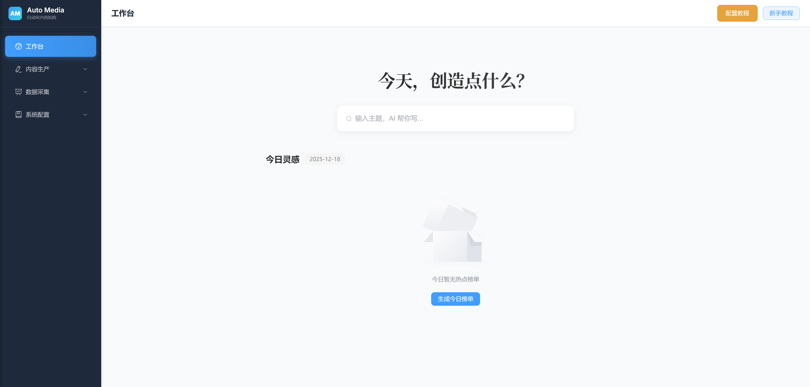
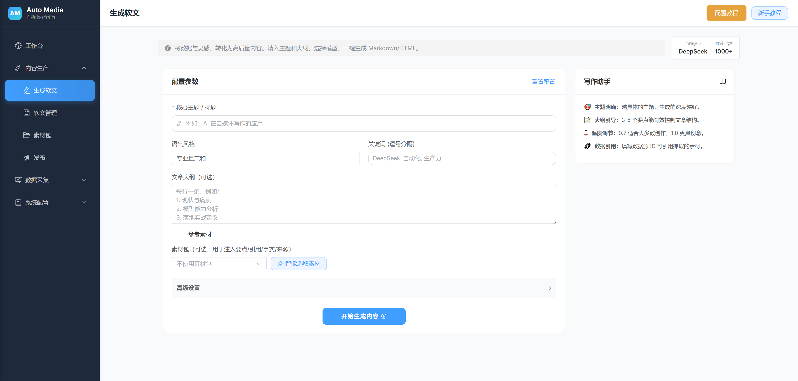

# 自媒体自动化系统

## 概述

- 目标：自动采集/整理数据源，调用大模型生成各种软文（如公众号）（Markdown + HTML），支持复制/一键发布。
- 技术栈：后端 FastAPI + MySQL + Redis + Celery；前端 Vue3 + Vite + Element Plus + Vue Router；多模型可切换（默认 DeepSeek）。
## 部分截图展示



## 环境准备

在开始之前，请确保您的系统中已安装以下软件：

- **Python 3.10+**: 后端逻辑运行环境。
- **Node.js 18+**: 前端构建与运行环境。
- **MySQL 8.0+**: 数据存储（建议字符集使用 `utf8mb4`）。
- **Redis**: 任务队列与缓存（Celery 需要）。

## 目录结构

```text
backend/                 # FastAPI 后端
  app/
    api/v1/endpoints/    # API 业务接口 (生成、素材、数据源等)
    core/                # 全局配置 (config) & 环境变量
    db/                  # 数据库连接 (base/session)
    models/              # SQLAlchemy ORM 模型
    schemas/             # Pydantic 数据结构定义
    services/            # 核心业务服务 (模型调用、抓取逻辑、Prompt构建)
    tasks/               # Celery 异步任务 (发布草稿、热点定时跑批)
    celery_app.py        # Celery 配置与初始化
    main.py              # 程序入口
  requirements.txt
  .env                   # 局部环境变量
frontend/                # Vue3 前端
  src/
    api/                 # 后端 API 接口封装
    components/          # 可复用组件
    layout/              # 页面整体布局
    router/              # 路由配置
    stores/              # Pinia 状态管理
    views/               # 业务页面 (生成、管理、配置等)
    styles/              # 全局样式与变量
    utils/               # 通用辅助函数
  package.json
```

## 环境配置

### 后端 .env（示例）

后端默认读取 `backend/.env`：

1. 从 `backend/.env.example` 复制一份到 `backend/.env`
2. **必须配置数据库连接**：修改 `MYSQL_URL` 为你本机 MySQL 的连接串（建议库字符集 `utf8mb4`）
3. **必须配置 Redis**：修改 `REDIS_URL` 为你本机 Redis 的连接串（Celery/队列/缓存依赖）
4. 其他配置（如模型 provider、Celery Beat 等）可按需配置；不配也能先跑起来（部分功能会受限）

注意：若 MySQL 库/表字符集非 `utf8mb4`，可能会导致写入热点条目时报错；后端启动会对 `event_*` 表做一次 utf8mb4 兼容迁移。

### 前端 .env

在 `frontend/.env` 填写后端地址：

```env
VITE_API_BASE=http://localhost:8010/api
```

## 后端运行

1. **安装依赖**:
   进入 `backend` 目录，执行：
   ```bash
   pip install -r requirements.txt
   ```

   如果你需要使用 [`crawl4ai`](https://github.com/unclecode/crawl4ai)（抓取/浏览器渲染相关能力），还需要额外完成浏览器依赖安装（至少安装一个浏览器内核，例如 Chromium）：

   ```bash
   # Install the package
   pip install -U crawl4ai
   
   # For pre release versions
   pip install crawl4ai --pre
   
   # Run post-installation setup
   crawl4ai-setup
   
   # Verify your installation
   crawl4ai-doctor
   
   # Install a browser (at least one)
   python -m playwright install --with-deps chromium
   ```
2. **启动服务**:
   ```bash
   uvicorn app.main:app --reload --host 127.0.0.1 --port 8010
   ```

接口探活：`GET http://localhost:8010/health`

### 本地启动模式（两种方式二选一）

#### 方式 A：Eager（推荐本地调试，少开进程）

适用：你希望只启动 `uvicorn`，不单独启动 Celery worker。

1. 在 `backend/.env` 增加：

```env
CELERY_ALWAYS_EAGER=true
```

1. 启动后端：

```bash
uvicorn app.main:app --reload --host 127.0.0.1 --port 8010
```

说明：开启后，`apply_async` 会在 Web 进程内立即执行（便于调试发布任务/离线任务）。

#### 方式 B：真异步（worker/beat）一键启动

适用：你希望保持与生产一致的异步执行方式（任务入队后由 worker 消费）。

在 `backend` 目录执行：

```powershell
# uvicorn + celery worker（Windows 下 worker 使用 -P solo）
powershell -ExecutionPolicy Bypass -File .\scripts\dev.ps1 -Port 8010

# uvicorn + celery worker + celery beat（需要定时任务时）
powershell -ExecutionPolicy Bypass -File .\scripts\dev.ps1 -Port 8010 -Beat
```

## 离线任务（Celery / Beat）

用于“每日热点榜单”自动跑批（阶段2）。

启动 worker（执行任务）：

```bash
# 注意：请在 backend 目录执行（或确保 PYTHONPATH 包含 backend），否则会出现 No module named 'app'
# Windows 推荐：-P solo
python -m celery -A app.celery_app.celery_app worker -l info -P solo
```

启动 beat（下发定时任务）：

```bash
python -m celery -A app.celery_app.celery_app beat -l info
```

说明：仅当 `DAILY_HOTSPOT_BEAT_ENABLED=true` 时会注册定时任务。

### API 文档

已有 API 列表与说明请查看：[`api.md`](./api.md)

## 前端运行

```bash
# 进入 frontend 目录
npm install
npm run dev
# 默认地址 http://localhost:5173
# data 来源走 VITE_API_BASE
```

## 标准流程（SOP）

主流程：采集/热点 → 素材包 → 生成 → 编辑 → 发布/导出。

- 极简：工作台输入主题一键生成
- 热点出稿：热点详情勾选要点/引用 → 写入素材包 → 生成
- 资料出稿：抓取记录沉淀为素材包 → 生成
- 混合：热点定方向 + 抓取补背景 + 手工补观点 → 同一素材包 → 生成

说明：生成的文章会保留素材来源，方便后续回溯与复盘。

